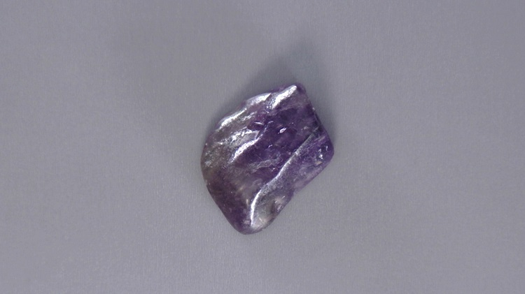
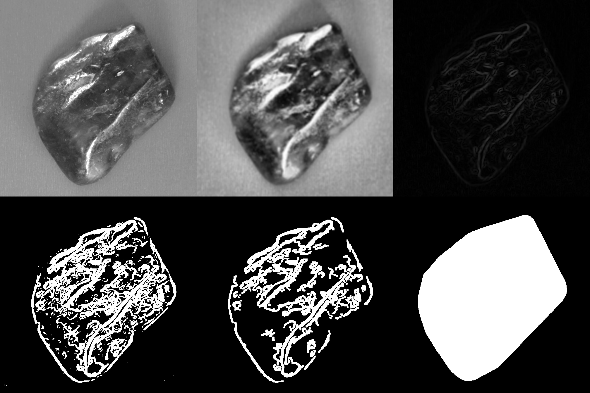
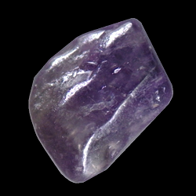

# Gemstone Classification Project README

## Overview

In this project, I implemented two classifiers for gemstones. One was a decision tree, and the other was a convolutional neural network (CNN) based on a pre-trained ResNet-50 network. Heavy focus was put on data generation; cleaning and processing the training images to optimize the performance of the classifiers. The majority of the code was done in MATLAB using its deep learning, statistics and machine learning, and parallel computing toolboxes. Some code was done in Python using OpenCV, NumPy, and scikit-image. 

My training dataset consisted of 770 images of 29 different types of gems. The images are 1920x1080 and they were taken with the gems on consistent backgrounds, under the same lighting and camera settings.

## Normalizing the images

The first thing I did in my project was normalize my training images to improve the classifier performance. This step is important *because* the gem backgrounds are relatively consistent. If I used the training images without normalizing, my classifiers likely wouldn’t generalize well to gems placed on different backgrounds. To account for that, I used image segmentation techniques to identify gem pixels and remove the backgrounds, giving me the normalized images that I used to train my classifiers. Below is an outline of my process.

1. **Grayscale conversion:**  The first step is converting the image to grayscale, to avoid dealing with color.

2. **Initial pre-processing:**  Next, I use adaptive histogram equalization to equalize the lighting. I also apply a heavy blur to the image.

3. **Sobel Edge Detection:**  I use Sobel edge detection on the blurred image to find the edge magnitudes. The blurring helps to reduce the impact background edges have, reducing the amount of noise.

4. **Binarization:**  I binarize the edges with a high threshold. Most background noise is removed in this step.

5. **Morphology and Connected-Component Labeling:**  Occasionally, there is still minor noise remaining. I use morphology and connected-component labeling to identify and remove it.

6. **Convex Hull Masking:**  I use the convex hull of the isolated gem edges as a mask to extract the gem from the original image, effectively removing the background.

7. **Centering, Cropping, and Resizing:**  The gem is centered, cropped, and resized to 224x224 for CNN training/feature generation.

Some of the steps in this process are shown below in Figures 1 and 2.

*Fig. 1. One of the images from the unaltered training dataset.*

*Fig. 2. An outline of the steps described above. The images from steps 1-5 are cropped for intelligibility. *\

*Top row: The initial grayscale image, that image equalized and blurred, and the resulting edge magnitudes.*\

*Bottom row: The binarized edges, those edges after noise removal, and their resulting convex hull.*

*Fig. 3. The final image. The convex hull is used as a mask to cut the gem out from the original image, resulting in a black background.*

## Feature Extraction and Decision Trees

With the backgrounds removed, my next step was to extract features from them for training decision trees. Some of the more important features in my final trees were: 

1. The average color 

2. The three most dominant colors (and their relative amounts)

3. The number of white, gray, and black pixels

4. The number of red, green, and blue pixels

5. The number of cyan, yellow, and magenta pixels

6. The size of the gem, calculated as gem-to-background ratio

7. The eccentricity of the gem

*Note: Whenever I mention color, I’m referring to colors calculated in the CIELAB color space rather than RGB. In testing, I found that using color spaces that separate light values from hue boosted my decision tree accuracy.*

My decision trees were trained using MATLAB’s fitctree function with the OptimizeHyperparameters flag, and they were tested internally with cross-validation. For my final results, I split 20% of the training data into a testing set. That set is what I used for all of my accuracy metrics, for both my decision trees and my CNNs. Most decision trees performed well, typically achieving 70-95% accuracy depending on the features included and the tree parameters.

## ResNet50

My neural network was a ResNet50 model that I fine-tuned using an augmented training dataset with random X and Y reflections. Gems are invariant to rotation, so adding in reflections helped to boost the dataset size without causing overfitting or reduced accuracy. I split my data into 65% training data, 15% validation (used for optimizing hyperparameters), and 20% testing. With a batch size of 64 and a learning rate of 0.0001, it took ~5 epochs to train with about 25 iterations per epoch. My final models achieved 99.5-100% accuracy on my testing sets.

## Challenges

Overfitting was an issue initially but I handled it by adding in an early stopping parameter so that training stopped once the loss on the validation set hadn’t changed for 3 iterations. Limited dataset size was another issue. The accuracy of my decision trees wasn’t as good as it good be, and I’m assuming that’s because they had either too little data or too few features for the existing data.

I was able to mitigate the dataset size somewhat for my ResNet50 model with data augmentation, but there were still problematic aspects. My CNNs had much higher accuracy than my decision trees, with some reaching 100% accuracy on my testing sets. Realistically, an accuracy that high is indicative that my testing set still wasn't broad enough. More work likely needs to be done on that end.

## Results

The decision tree model achieved an accuracy of 94.1176% on the testing set, and the ResNet50 model achieved 100% accuracy. Misclassifications in the decision tree were mainly due to similarities in gemstone color and appearance (i.e. clear quartz vs rose quartz). 

## Discussion

I chose to work on a decision tree classifier in addition to a CNN because I appreciate how they avoid the ‘black box’ issues neural networks have. My root decisions were basic and understandable (i.e. is the gem more white or black? -> is it more green or red? -> ...), often relying on the dominant and average color features, and rarely using features like gem size to differentiate between difficult classifications. Even with that simple structure, they’re still able to achieve a high accuracy.

There are many areas for improvement. In future iterations, I would want to implement texture analysis as a feature for my decision trees. My decision trees mainly work through color analysis, currently, the texture information is completely ignored. I think that’s one of the reasons why my decision trees never reached the same accuracy as my neural nets. I’d also like to augment my dataset more, and possibly introduce minor color/lighting jittering to improve the accuracy on gems with similar colors.  